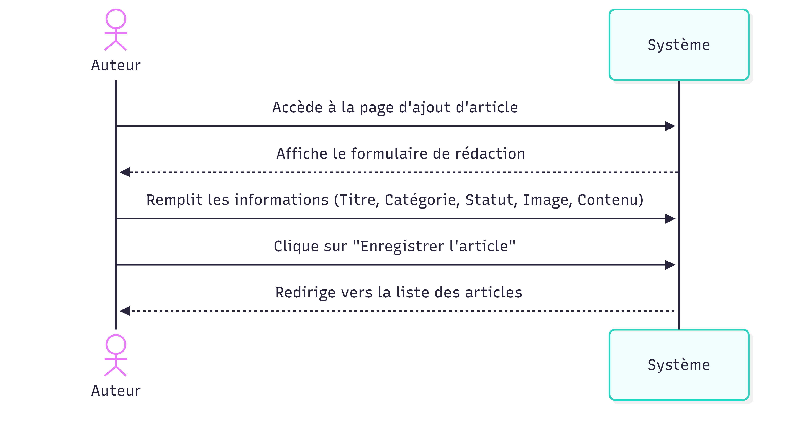

**Cas d’utilisaton :** Ajouter un article  
**Acteur princpal :** Auteur  
**Précondtion :** L’Auteur est connecté au blog.  
**Déclencheur :** L’Auteur souhaite rédiger un novuel article.  

### Scénario nominal :

1. L’Auteur accède à la page d’ajout d’artcle.
2. Le système affche le formulaire de rédaction.
3. L’Auteur saisit le titre, sélectonne la catégorie et le statut, ajoute une image et rédige le contnu.
4. L’Auteur clique sur le bouton “Enregistrer l’article”.
5. Le système sauvegarte l’article dans la base de données.
6. Le système redirige l’Auteur vers la liste des artcles.

